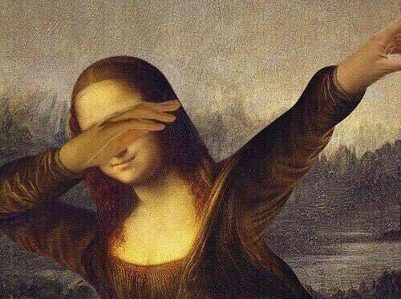
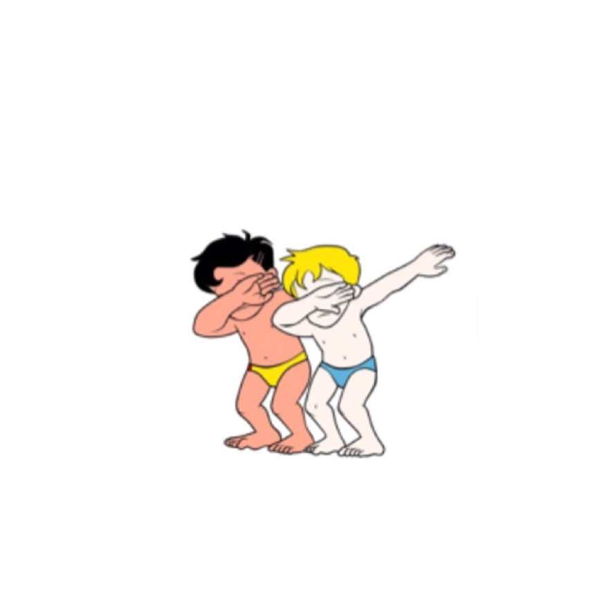

# 实现carousel轮播图
## 需求与分析
**需求：**<br />循环无缝自动轮播五张图，按左右箭头可以手动切换图片，鼠标点击轮播图下面按钮 1 2 3 4 5会跳转到对应的第1 2 3 4 5张图片。鼠标放到轮播图的图片上时不再自动轮播并且左右箭头显示出来，鼠标移开时左右箭头隐藏掉并且自动轮播。<br />

**分析：**<br />
布局：准备七张图片实现所谓的无缝轮播，固定七张图片的宽高，下面假设为600px\*400px。假设html分为三个区：图片区、按钮区、箭头区。然后用个div包住这三个区并且固定该div的宽高也为600\*400。<br />
<br />
样式：左右居中、距离页面顶部100px显示。五个按钮为圆形的，并且轮播到哪张图或者点到哪个按钮时，该按钮颜色变化。其余的小样式具体写代码的时候佛系添加。<br />
<br />
JS脚本：就说明一点图的摆放位置，其余写到那部分代码的时候再说。<br />
七张图中，有两张是和那不同的五张图片中的第一张、第五张相同的。其中和五张不同图中和第一张相同的图放置在七张图片中第七张，和五张不同图中和第五张相同的图放置在七张图片中第一张。原因写到那部分代码时会再说

## 实现步骤
1. 先来个html框架
```
<body>
    <div class="container">
        <div class="wrap">
            
            
            
            
            
            
            
        </div>
        <div class="button">
            <span>1</span>
            <span>2</span>
            <span>3</span>
            <span>4</span>
            <span>5</span>
        </div>
        <a href="javascript:void(0);" class="jt jt_left">&lt;</a>
        <a href="javascript:void(0);" class="jt jt_right">&gt;</a>
    </div>
```
给a标签加 `javascript:void (0);`是为了不让a标签跳转。<br />
2. 定义样式 <br />
主要目的：给总div、图片区按钮区div、图片、按钮、左右箭头定义宽高，让七个图片并排显示，五个按钮位于图片底部居中显示，两个箭头分别到左右两边的适中位置显示。
```
/* 清除默认样式 */
*{
    margin: 0;
    padding: 0;
    text-decoration: none;
}
/* 总div */
div.container{
    position: relative;
    width: 600px;
    height: 400px;
    margin: 100px auto 0 auto;
    box-shadow: 0 0 5px aqua;
    overflow: hidden;
}
/* 图片区 */
div.container div.wrap{
    position: absolute;
    width: 4200px;
    height: 400px;
    z-index: 1;
}

div.container div.wrap img{
    width: 600px;
    height: 400px;
    float: left;
}
/* 按钮区 */
div.container div.button{
    position: absolute;
    right: 225px;
    bottom: 15px;
    width: 150px;
    height: 20px;
    z-index: 2;
    text-align: center;
}

div.container div.button span{
    margin-left: 5px;
    display: inline-block;
    width: 20px;
    height: 20px;
    border-radius: 50%;
    background-color: greenyellow;
    text-align: center;
    color: white;
    cursor: pointer;
    opacity: 0.6;
}
/* 轮播到哪张图，哪个按钮有这个效果，与其他按钮有个区别。 */
div.container div.button span.on{
    opacity: 1;
}
/* 箭头区 */
div.container .jt{
    position: absolute;
    top: 40%;
    color:greenyellow;
    padding: 0px 14px;
    font-size: 55px;
    text-align: center;
    z-index: 2;
    display: none;
}

div.container .jt_left{
    left: 10px;
}

div.container .jt_right{
    right: 10px;
}

div.container:hover .jt{
    display: block;
    opacity: 0.4;
}

div.container .jt:hover{
    opacity: 1;
}
```
为了让刚进页面第一张图显示的是1.jpg,所以在图片区图里面加个行内样式，让默认打开页面显示这个图：<br />
`<div class="wrap" style="left:-600px">...</div>`
此时效果是当鼠标移动到图片上、箭头处都有一些样式。

3. JS脚本 <br />
第一步：实现图片自动切换<br />
封装两个函数：next()、prev()函数，分别对应向右轮播和向左轮播，此时调用哪个函数，就可以向哪个方向一张图片一张图片得切换轮播。
```
var wrap = document.getElementsByClassName('wrap')[0];

var newLeft = -600;

function next() {
    setInterval(function(){
        if(newLeft == -2400){
            newLeft = 0;
        }else{
            newLeft = parseInt(wrap.style.left) - 600;
        }
        wrap.style.left = newLeft + 'PX';
    },1000)
}

function prev() {
    setInterval(function(){
        if(newLeft == -600){
            newLeft = -3000;
        }else{
            newLeft = parseInt(wrap.style.left) + 600;
        }
        wrap.style.left = newLeft + 'PX';
    },1000)
}
```
第二步：让轮播的时候各个图片有运动轨迹地切换，而不是硬生生地从一张图片变到另一张图片。<br />
这里需要用到我封装好的一个运动函数startMove()，做成工具使用：
```
function getStyle(obj, attr){
    if(obj.currentStyle){
        return obj.currentStyle[attr];
    }else{
        return getComputedStyle(obj, false)[attr];
    }
}

//运动框架 startMove函数    
function startMove(obj,json,fn){       
    clearInterval(obj.timer);      
    //开启定时器        
    obj.timer = setInterval(function(){  
        var flag = true;                 
        //遍历json               
        for (var attr in json) {                                
            //取当前值 iCur   
            var iCur = 0;                
            if (attr == 'opacity') {                       
                iCur = Math.round(parseFloat(getStyle(obj, attr))*100);                  
            }else{                     
                iCur = parseInt(getStyle(obj, attr));                
            }                  
            //算速度：iSpeed
            //目标值：json[attr]                   
            var iSpeed = (json[attr]-iCur)/8;
            iSpeed = iSpeed > 0 ? Math.ceil(iSpeed) : Math.floor(iSpeed);                       
            //检测停止                 
            if (iCur != json[attr]) {                      
                flag = false                 
            }                  
            if (attr == 'opacity') {                       
                obj.style.filter = 'alpha(opacity:'+iCur+iSpeed+')';                      
                obj.style.opacity = (iCur+iSpeed)/100;                
            }else{                     
                obj.style[attr] = iCur + iSpeed + 'px';                   
            }   
        }        
        if (flag) {                  
            clearInterval(obj.timer);                  
            if (fn) {fn();}               
        }                     
    },30)      
}
```
这个封装的运动函数这里，加上我的注释还看不懂代码的，可以去看看这个视频，这讲师讲得很清楚：[JS动画效果](https://www.imooc.com/learn/167)<br />
然后利用这个原理：当图片往右轮播到第六张的时候，马上让第一张呈现出来，紧接着调用封装好的运动函数让从第一张图运动切换到第二张。往左轮播时也是一样的道理，当轮播到第一张的时候马上让第六张呈现出来，紧接着从第六张运动到第五张。这样子从视觉上看来就是五张图片一直循环无缝轮播下去的<br />
**这是也为什么要用七张图片，并且第一张图片和第六张一样，第七张和第二张一样的原因。**
代码如下：
```
var wrap = document.getElementsByClassName('wrap')[0];

var newLeft = -600;

function next() {
    setInterval(function () {
        if (newLeft == -3000) {
            newLeft = 0;
            wrap.style.left = newLeft + 'px';
        }
        newLeft -= 600;
        startMove(wrap, {
            "left": newLeft
        })
        // wrap.style.left = newLeft + 'PX';
    }, 3000)
}

function prev() {
    setInterval(function () {
        if (newLeft == 0) {
            newLeft = -3000;
            wrap.style.left = newLeft + 'px';
        }
        newLeft += 600;
        startMove(wrap, {
            "left": newLeft
        });
    }, 3000)
}
```
第三步：使当鼠标移到图片上时，停止自动轮播而让点击几次左右箭头来控制往左右一张一张地轮播几张。<br />
**核心原理**：清除定时器，绑定click、onmouseenter、onmouseleave事件，重构下代码封装出往右往左轮播函数和自动轮播函数。<br />
往右轮播函数：
```
function next() {
    if (newLeft == -3000) {
        newLeft = 0;
        wrap.style.left = newLeft + 'px';
    }
    newLeft -= 600;
    startMove(wrap, {
        "left": newLeft
    });
}
```
往左轮播函数：
```
function prev() {
    if (newLeft == 0) {
        newLeft = -3000;
        wrap.style.left = newLeft + 'px';
    }
    newLeft += 600;
    startMove(wrap, {
        "left": newLeft
    });
}
```
自动播放函数：
```
var timer = null;

function autoPlay() {
    timer = setInterval(function () {
        next();
    }, 2000)
} /* 自动播放 */
```
绑定各个事件：
```
container.addEventListener('mouseenter', function () {
    clearInterval(timer);
}, false)

container.addEventListener('mouseleave', function () {
    autoPlay();
}, false)

left.addEventListener('click', function () {
    prev();
})

right.addEventListener('click', function () {
    next();
})
```
第四步：
+ 处理按钮，使刚进页面时，第一个按钮有span元素中类为'on'的效果。
+ 接下来，实现视觉上轮播到哪张图了，就对应哪个按钮有类为'on'的效果。
+ 最后，当你点到哪个按钮时，该按钮有类为'on'的效果，并且跳转到视觉上的第几张图。<br /><br />
封装个处理按钮的函数，功能是给每个按钮的类名设置为空，然后当视觉上移动到第A张图时，就让此时这第A个按钮的类型为'on'。<br />
所以需要设置个哨兵index监听这是视觉上第几张图，然后为这张图对应的按钮添加'on'类：
```
//处理按钮
var index = 0;
var len = dot.length;
function setCurrentDot(){
    for (var m = 0; m < len; m++){
        dot[m].className = ''; 
    }
    dot[index].className = 'on';
}
setCurrentDot();
```
此时调用了这个函数的话，就等于刚进入页面的时候默认显示的第一张图片也是默认让第一个按钮有'on'类的效果。<br /><br />
那怎么让当视觉上移动到第A张图时，就让此时这第A个按钮的类型为'on'呢？<br />
可以在轮播一次的函数里加入修改index哨兵的值并且调用setCurrentDot()函数。在next()中:
```
    index++;
    if(index === 5){
        index = 0;
    }
    setCurrentDot();
```

在prev()中:
```
    index--;
    if(index === -1){
        index = 4;
    }
    setCurrentDot();
```
最后，实现点到哪个按钮时，该按钮有类为'on'的效果，并且跳转到视觉上的第几张图。<br />
**核心思路**：当点击该按钮时，比如点了第三个按钮，那么此时应该显示的图片应该是视觉上第三张图片也就是七张图片中的第四张，第四张对应的wrap的left为-1800px，然后找出对应的规律，此时的newLeft就应该为：-600 * (x + 1)。那么不管在点击按钮前已经轮播到哪里了，只要在点击后，使用运动函数startMove()移动到这个newLeft位置处就行了。按例子来说此时的哨兵index也等于3，因为点了第几个按钮肯定就第几个按钮有'on'类咯。<br /><br />
根据核心思路写出代码为(这里需要注意绑定事件时的闭包问题)：
```
// 点到哪个按钮时，该按钮有类为'on'的效果，并且跳转到视觉上的第几张图。
for (var s = 0; s < len; s++){
    (function(s){
        dot[s].addEventListener('click',function(){
            newLeft = -600 * (s + 1);
            startMove(wrap,{"left":newLeft});
            index = s;
            setCurrentDot();
        },false)
    }(s))
}
```
写到这里，所以需求就做完了。
## 最后
思路就是这样，重要的不是代码，是分析逻辑。
源码已传到[github](https://github.com/YxrSadhu/carousel)，觉得对您有帮助的，麻烦点个star，谢谢~